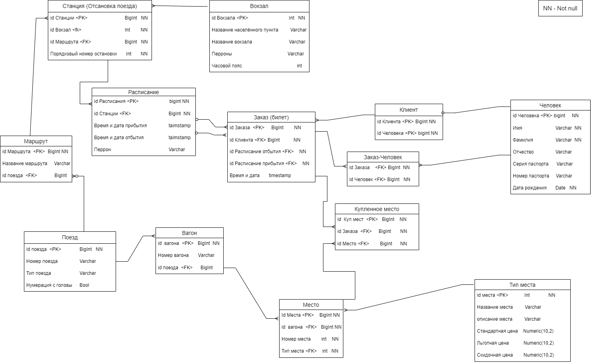

# Домашняя работа по REST API (ЖД билеты)
***
### Главы
I. Пример использования  
II. База данных  

## Пример использования 
***
##### Запрос расписания поездов по маршруту Липецк-Москва на типе поезда Победа (GET):
`http://localhost:8080/schedule?arrival=Липецк&departure=Москва&train=Победа`

Все значения в формате String.  
Результат запроса:
```json
[
{
"id_route": 1,
"type_train": "Победа",
"name_departure": "Липецк",
"time_departure": "2023-08-26T21:25:00.000+00:00",
"id_time_departure": 27,
"name_arrival": "Москва",
"time_arrival": "2023-08-27T08:07:00.000+00:00",
"id_time_arrival": 33
}
]
``````
>Код: 200 OK 
>
| Поле              | Тип          |
|-------------------|--------------|
| id_route          | Long         |
| type_train        | String       |
| name_departure    | String       |
| time_departure    | TimeStampz   |
| id_time_departure | Long         |
| name_arrival      | String       |
| time_arrival      | TimeStampz   |
| id_time_arrival   | Long         |


Варианты обрабатываемых ошибок:
1. Ошибка связанная с БД. 
_Эта ошибка может возникнуть и в других запросах поэтому повторять её не будем_
```json
{
    "error": "Ошибка при выполнении запроса в БД",
    "debugMessage": "Failed to obtain JDBC Connection"
}
``````
> Код: 500 Internal Server Error
>

2. Отсутствуют подходящие данные:
```json
{
    "error": "Расписание не найдено"
}
``````
>Код: 404 Not Found
##### Запрос на оформление билетов с проверкой (GET):
_То как он работает описано в пункте II._

`http://localhost:8080/ticket?client=1&departure=1&arrival=5&placeList=6,7&personList=4,5`

| Key         | Value | Type  | Пояснение                                                      |
|-------------|-------|-------|----------------------------------------------------------------|
| client      | 1     | Long  | __id клиента__ - тот кто покупает билет                        |
| departure   | 1     | Long  | __id расписания точки отправление__ - то откуда и когда поедут |
| arrival     | 5     | Long  | __id расписания точки прибытия__ - то куда и когда поедут      |
| placeList   | 4,5   | Long  | __id места__ - место(а) которое(ые) хотят приобрести           |
| personList  | 6,7   | Long  | __id человека__ - один или несколько человек                   |
```json
[
    {
        "bookingId": 16,
        "boughtplaceId": 36
    },
    {
        "bookingId": 16,
        "boughtplaceId": 37
    }
]
``````
> Код 200 OK  
>
Возварщает id билета и id купленного места. Оба значения имею тип Long

Варианты обрабатываемых ошибок:
1. Ошибка связанная с БД. _Описана выше._
2. Места уже куплены.
```json
   {
   "error": "Места уже куплены"
   }
``````
> Код: 400 Bad Request
3. В случае указания мест которых нет вернётся код 500, error 
об ошибке БД и debugMessage с информацией о деталях.  
_Возможно стоит отдельно её обрабатывать.
Но на практике мне кажется эта ошибка недостижима (а именно тот кто кидает этот запрос и так точно знает какой id у данного места, 
а если и не знает значит проблема в том, почему он его не знает). 
А обработка приведёт к усложнению и так тяжелой функции покупки билета._
#### Запрос на отмену билета (DELETE)
`http://localhost:8080/deletebooking?booking=1`  

Значением booking является id заказа тип Long.
Варианты обрабатываемых ошибок:
1. Ошибка связанная с БД. _Описана выше._
2. Указан id заказа которого не существует или менее 2‑х часов до выезда.
```json
   {
   "error": "Заказ нельзя отменить"
   }
``````
> Код: 404 Not Found
>
#### Запрос на получение статистики о пользователях (GET)
`http://localhost:8080/routeStatClientAge?id_route=1&dateFrom=1900-01-01&dateTo=2030-01-01&step=10&maxAge=80`

| Key      | Value      | Type | Пояснение                 |
|----------|------------|------|---------------------------|
| id_route | 1          | Long | id маршрута               |
| dateFrom | 1900-01-01 | Date | Дата __от__               |
| dateTo   | 2030-01-01 | Date | Дата __до__               |
| step     | 10         | int  | __Шаг__  _пояснение ниже_ |
| maxAge   | 80         | int  | Максимальный возраст      |

Допустим, мы хотим получить статистику по маршруту с id 1 за промежуток времени с 1900 по 2030 год.
Так же мы хотим чтобы пассажиры были сформированы в группы с шагом (step) в 5 лет. 
А максимальный возраст (maxAge) 60 лет.  
Выполним запрос и получим:
```json
{
  "0": 0,
  "5": 0,
  "10": 0,
  "15": 0,
  "20": 1,
  "25": 0,
  "30": 0,
  "35": 1,
  "40": 1,
  "45": 2,
  "50": 0,
  "55": 0,
  "other": 1
}
``````
Как мы видим пассажиры сформированы в группы по следующему принципу:  
Пассажиры в возрасте от 0 до 5 лет находятся в группе "0", а например в 
группу 45 (то есть пассажиры в возрасте 45-50) входит 2 пассажира. В группу other входят пассажиры возраст 
которых превышает значение maxAge.

Варианты обрабатываемых ошибок:
1. Ошибка связанная с БД. _Описана выше._
2. При указании данных которых нет в БД мы получим ошибку.
```json
{
"error": "Не найдено людей по заданному маршруту, за заданный период"
}
``````
3. При указании допустим -1 как значение для Step мы получим ошибку.
```json
   {
   "error": "Произошла ошибка при подсчёте, возможно не верный step или maxAge"
   }
``````
#### Не рассмотренный вид ошибки
Выполним заведомо не верный запрос на удаление.  
`http://localhost:8080/deletebooking?booking=всех`
 
При выполнении подобного запроса мы получим такого рода ошибку:
```json
{
    "error": "Ошибка в формате переданного значения: Failed to convert value of type 'java.lang.String' to required type 'java.lang.Long'; For input string: \"всех\""
}
``````
## База данных
***



_Пояснять связи, сущности, атрибуты не станем. В противном случае это займёт очень много текста и можно будет уснуть_ 😴.

Рассмотрим лишь созданные функции внутри БД. Все они нужны для запроса на оформление билета.  
Как видно из рисунка у таблички "Заказ" есть 3 зависимых таблички. Это "Клиент" (тот кто покупает билет) и таблица
"Купленное место". На заполнение каждой таблицы создана отдельная функция _посмотреть код функций можно в файле "DataBase/более читабельный бэкап БД"_.  
Эти 3 функции объединены одной общей функцией. Объединение необходимо из-за двух факторов:
1. В таблице Заказ есть поле id которое имеет тип BigSerial, а значит после заполнения СУБД выдаст id нашей записи.
Данный id нужно будет передать 2‑м другим функциям чтобы и они могли заполнить свои поля. _Возможно есть другой способ, но я до него не додумался._
2. Нужно выполнить проверку, является ли место купленным.  

Для понимания приведу код объединяющей функции:
```
CREATE FUNCTION public.combined_function(id_client bigint, id_arrival_timetable bigint, id_departure_timetable bigint, id_place_arr bigint[], id_person bigint[]) RETURNS TABLE(booking_id bigint, boughtplace_id bigint)
LANGUAGE plpgsql
AS $$
DECLARE
booking_id BIGINT;
boughtplace_ids BIGINT[];
temp_booking_id bigint;
BEGIN
-- Проверка условия
WITH check_places AS (
        SELECT bp.id_place
        FROM boughtplace bp
        JOIN (
        SELECT DISTINCT b.id_booking
        FROM booking b
        JOIN (
        SELECT tim.id_timetable
        FROM timetable ta
        JOIN timetable td ON td.id_timetable = id_arrival_timetable
        JOIN station sa ON ta.id_station = sa.id_station
        JOIN station sd ON td.id_station = sd.id_station
        JOIN station s ON s.serial_number_station BETWEEN sa.serial_number_station AND sd.serial_number_station
        JOIN timetable tim ON tim.id_station = s.id_station
        WHERE ta.id_timetable = id_departure_timetable
        ) sub ON sub.id_timetable = b.id_arrival_timetable OR sub.id_timetable = b.id_departure_timetable
        ) zak ON zak.id_booking = bp.id_booking
        WHERE bp.id_place = ANY(id_place_arr)
)
SELECT array_agg(id_place) INTO boughtplace_ids FROM check_places;

    -- Если проверка вернула значения, вернуть -1
	IF boughtplace_ids IS NOT NULL THEN
    	RETURN QUERY
    	SELECT -1::bigint AS booking_id, unnest(boughtplace_ids) AS boughtplace_id;
		RETURN;
	END IF;


    -- Выполняем insert_booking и получаем id_booking
    booking_id := insert_booking(id_client, id_arrival_timetable, id_departure_timetable);

    -- Выполняем insert_boughtplace и получаем id_boughtplace
    boughtplace_ids := ARRAY(Select * from insert_boughtplace(booking_id, id_place_arr));

    -- Выполняем insert_booking_person
    PERFORM insert_booking_person(booking_id, id_person);

    -- Возвращаем значения id_boughtplace
	temp_booking_id := booking_id;
    RETURN QUERY
    SELECT temp_booking_id, unnest(boughtplace_ids) AS boughtplace_id;
	RETURN;
END;
$$;
```
Но так же мне __кажется__, что может возникнуть ситуации, которая приведёт к логической ошибке в заполнении БД.
А именно представим ситуацию:  
Два пользователя "практически одновременно" начали покупать одно и то же место.
Оба выполнили проверку на то что место не занято. 
Потому что первый или второй клиент ещё не успел заполнить таблицы.  

Варианты решения:  
1. Сделать уникальные поля допустим в таблице "Купленные билеты" нельзя. 
Так как место может быть куплено несколько раз за маршрут 
(один пассажир сел и доехал из Анапы в Липецк, а второй сел в Липецке и доехал до Питера. 
Все это один маршрут Анапа-Питер с одним и тем же местом).  
2. Можно сделать дополнительные проверки в объединяющей функции,
но я не знаю насколько сильно это будет замедлять работу СУБД в реальных условиях с реальным объёмом данных.  
3. Так же можно сделать дополнительную таблицу или связь.  
Но есть ощущение, что это всё попытки спроектировать костыль к неправильно спроектированной БД.

Спасибо, что вникли 😊.

